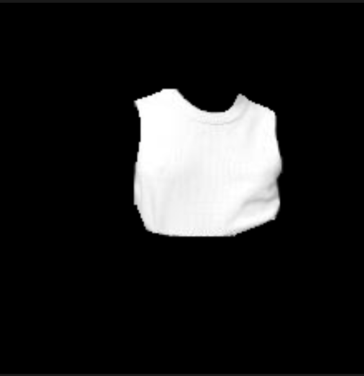
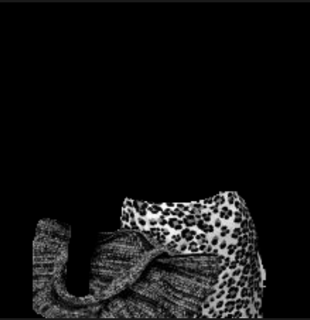
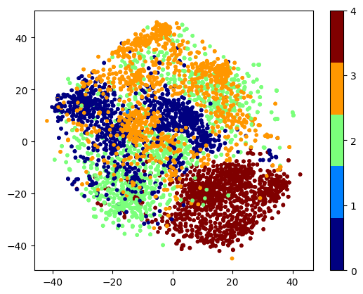
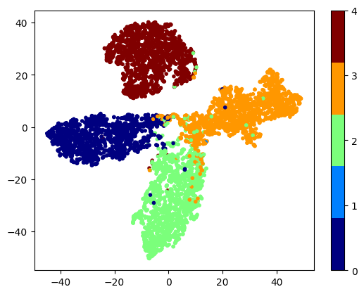

# Image Search Engine Use-Case
This repository contains an image search engine fine-tuned on the [my-first-project-klagq](https://universe.roboflow.com/azza-te8hj/my-first-project-klagq) dataset for real-time retrieval.

The search engine can perform the following operations:

 - Upload images to local storage and record state in database
 - Generate segmentation masks of main image components (using [YOLOE](https://docs.ultralytics.com/models/yoloe/))
 - Generate embeddings from segmentation masks and store them in the [qdrant](https://qdrant.tech/) vector database for indexing and similarity search 
 - Perform vector search using qdrant

## Installation
The engine may be started locally by running:
```
docker compose up -d --build
```
The application loads all required model weights during startup. Once initialized, it becomes fully operational and ready to serve requests.
```
docker logs pixo-app
...
> 100%|██████████| 44.7M/44.7M [00:03<00:00, 12.8MB/s]
> INFO:     Application startup complete.
> INFO:     Uvicorn running on http://0.0.0.0:8000 (Press CTRL+C to quit)
```
## End-to-end Testing
To test the end-to-end functionality, please install the necessary packages
```
conda create -n pixo python=3.10
conda activate pixo
pip install -r requirements-client.txt
```

And run the following test script:

```
pytest --log-cli-level=INFO tests/integration/test.py
```


## API Usage Examples
The API supports the following functionalities: upload image; segment and compute segment embeddings of uploaded image, retrieve similar image.
### Upload image
```
curl -X POST "http://127.0.0.1:8000/upload" -F "file=@assets/demo_human.jpg"
```
### Segment and compute segment embeddings
```
IMAGE_ID="734b86aa-3a3a-4805-add1-cee210a67a10" # use retrieved image ID
curl -X POST http://127.0.0.1:8000/segment/${IMAGE_ID} \
     -H "Content-Type: application/json" \
     -d '{"mode": "quick"}'
```
### Retrieve similar image
```
curl -X POST "http://127.0.0.1:8000/search" \
  -H "accept: application/json" \
  -H "Content-Type: multipart/form-data" \
  -F "file=@assets/debug_guepard.jpg"
```

## API Documentation & Testing
The FastAPI application provides comprehensive interactive API documentation.

- [Swagger UI](http://127.0.0.1:8000/docs): this allows testing all endpoints directly in the browser with file uploads, JSON responses, and results
- [ReDoc](http://127.0.0.1:8000/redoc): API documentation
- [OpenAPI Schema](http://127.0.0.1:8000/openapi.json): machine-readable API specification


## Monitoring & Logging

- [Prometheus Metrics](http://localhost:9090): scrapes metrics from FastAPI application **/metrics** endpoint
- [Grafana Dashboard](http://localhost:3000): visualization platform connected to Prometheus can be used to view relevant metrics ([default username and password](https://signoz.io/guides/what-is-the-default-username-and-password-for-grafana-login-page/#grafanas-default-username-and-password))


## Architecture and Approach

### System Overview
Image Upload → Segmentation (YOLOE) → Embedding Generation (Few-shot fine-tuned ResNet18) → Vector Search (Qdrant)

### Segmentation Model Selection
For image segmentation [YOLOE](https://docs.ultralytics.com/models/yoloe/) was used. This model provides open-vocab detection and segmentation capabilities in real-time, which is a good choice for extracting most meaningful image components

**Original**


**Segmentations**

<p float="left">
  
  
  
</p>


### Embeddings Model Selection
Embedding model chosen was a [resnet18](https://docs.pytorch.org/vision/main/models/generated/torchvision.models.resnet18.html) backbone trained on [ImageNet](https://www.image-net.org/)

### Few-shot fine-tuning strategy

The embeddings model has been fine-tuned using a Prototypical Network methodology via the **train_few_shot.ipynb** notebook implemented using the [easy-few-shot-learning](https://github.com/sicara/easy-few-shot-learning) framework. Fine-tuning has increased accuracy on a refence eval from 65.40% to 88.20%.

**Pre-trained**




**Few-shot fine-tuned**


